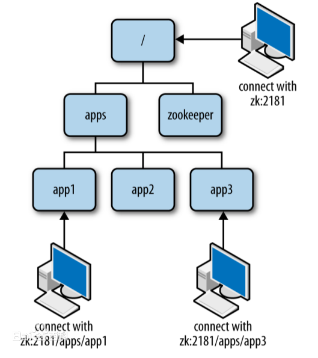
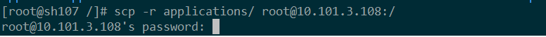
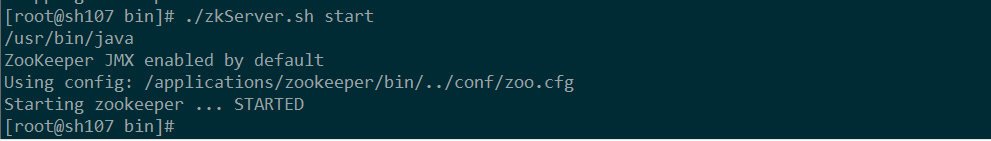
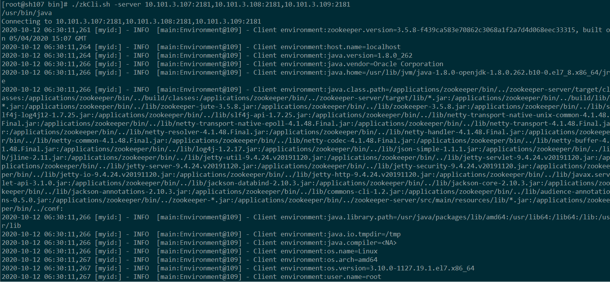
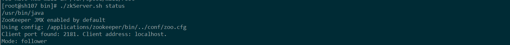

# zookeeper集群搭建
ZooKeeper是一个分布式的，开放源码的分布式应用程序协调服务，是Google的Chubby一个开源的实现，是大数据框架Hadoop和Hbase、Elasticsearch的重要组件。

----------
## 目录
* [1.概述](## 1.概述)
	* 2.1 系统依赖
    * 2.2 安装包
* [2.快速部署](## 2.快速部署)
    * 2.1 下载Zookeeper程序
    * 2.2 解压zookeeper到/applications目录
    * 2.3 配置zookeeper
    * 2.4 生成数据和日志目录
    * 2.5 远程拷贝zookeeper到各个节点
    * 2.6 给zookeeper各节点分配server-id
    * 2.7 启动zk服务
* [3.测试](## 3.测试)
* [参考链接](## 参考链接) 

----------

### 1. 概述：
Zookeeper是Apache的一个java项目，属于Hadoop系统，扮演管理员的角色。因本文偏向于zk集群的部署搭建，所以对zk的原理不做过多概述。[点击了解Zookeeper技术原理](https://www.cnblogs.com/arjenlee/articles/9224366.html)

#### 1.1 系统依赖
- Java 8
- zookeeper
- Centos 7

#### 1.2 安装包
[点击获取zookeeper安装程序](./install/apache-zookeeper-3.5.8-bin.tar.gz)，大小约9M左右。

#### 1.3 Zookeeper集群
CPU： 8  Intel(R) Xeon(R) CPU E5-2670 0 @ 2.60GHz

内存： 16G

磁盘空间：100G

| 服务器         | server-id      |install path    |
| ------------- |:-------------:|:-------------:|
| 10.101.3.107  |  1             |/applications/zookeeper |
| 10.101.3.108  |  2             |/applications/zookeeper |
| 10.101.3.109  |  3             |/applications/zookeeper |

### 2.快速部署：
在服务器上安装jdk1.8，由于系统模板已经集成jdk 1.8.0_262-b10,所以这里不在单独安装。
> 安装思路：先选择其中任意一台服务器上配置好服务，然后把程序远程拷贝到其它节点，再到各个节点分配好相应的server-id，最好启动每台服务器上的zk服务完成部署。

#### 2.1 下载Zookeeper程序
> 请下载1.2中链接的安装包程序。

#### 2.2 解压zookeeper到/applications目录
解压命令：
	# 若无则创建此目录
	mkdir /applications
	tar zxvf  apache-zookeeper-3.5.8-bin.tar.gz -C /applications
重命名目录：

	cd /applications
	mv apache-zookeeper-3.5.8-bin zookeeper

#### 2.3 配置zookeeper
备份默认配置：

	# 备份默认配置
	cp zookeeper/conf/zoo_sample.cfg zookeeper/conf/zoo_sample.cfg.bak
	mv zookeeper/conf/zoo_sample.cfg zookeeper/conf/zoo.cfg
	# 注释掉zoo.cfg所有配置

修改如下：

    tickTime=2000
	dataLogDir=/applications/zookeeper/logs
	dataDir=/applications/zookeeper/data
	clientPort=2181
	initLimit=10
	syncLimit=5
	autopurge.snapRetainCount=500
	autopurge.purgeInterval=24
	server.1=10.101.3.107:2888:3888
	server.2=10.101.3.108:2888:3888
	server.3=10.101.3.109:2888:3888

#### 2.4 生成数据和日志目录
依据上一步中的配置，生成目录指令如下：

	# 生成日志目录
	mkdir -p /applications/zookeeper/logs
	# 生成data目录
	mkdir -p /applications/zookeeper/data

#### 2.5 远程拷贝zookeeper到各个节点
远程拷贝指令

	# 远程拷贝到10.101.3.108，输入root账户的密码完成传输
	scp -r applications/ root@10.101.3.108:/
	# 远程拷贝到10.101.3.109，输入root账户的密码完成传输
	scp -r applications/ root@10.101.3.109:/

效果如下：

#### 2.6 给zookeeper各节点分配server-id
此步骤需要远程登录到各个节点进行手动分配。

	#10.101.3.107节点的server-id分配指定为1；
	echo "1"> /applications/zookeeper/data/myid
	#10.101.3.108节点的server-id分配指定为2； 
	echo "2"> /applications/zookeeper/data/myid
	#10.101.3.109节点的server-id分配指定为3；
	echo "3"> /applications/zookeeper/data/myid
查看分配结果如下：

#### 2.7 启动zk服务
分别进入到各节点的/applications/zookeeper/bin/下启动 zookeeper

	cd  /applications/zookeeper/bin/
	./zkServer.sh start

启动成功！

### 3.测试：
测试集群的效果：

	cd  /applications/zookeeper/bin/
	./zkCli.sh -server 10.101.3.107:2181,10.101.3.108:2181,10.101.3.109:2181

集群相应正常（日志中无任何err异常打印）：

查看zk集群的日志
	
	./zkServer.sh status

集群响应正常：

## 参考链接
- Zookeeper原理架构：https://www.cnblogs.com/arjenlee/articles/9224366.html